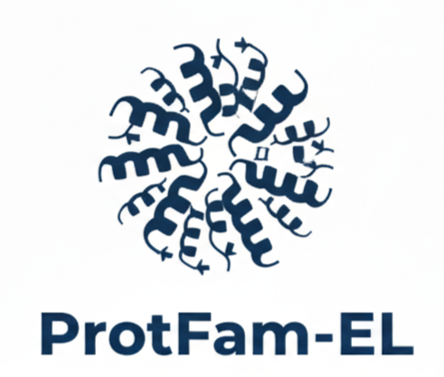

<table width="100%">
 <tr>

<h1 style="margin-bottom: 10px;" >ProtFam-EL</h1>

<p style="margin-top: 0;">
Protein Functional Family Classification using Ensemble Machine Learning
</p>
<td width="25%" valign="top" align="right">
     
</td>

 <table>
  <tr>
    <td><b>Dataset</b></td>
    <td>:</td>
    <td>Kaggle Bioinformatics Protein Dataset (Simulated)</td>
  </tr>
  <tr>
    <td><b>Link</b></td>
    <td>:</td>
    <td>
      <a href="https://www.kaggle.com/datasets/gallo33henrique/bioinformatics-protein-dataset-simulated/data">
        View Dataset
      </a>
    </td>
  </tr>
  <tr>
    <td><b>Target</b></td>
    <td>:</td>
    <td>Achieve &gt;80% classification accuracy with interactive web application</td>
  </tr>
 </table>
 </td>

<h2>Ensemble Learning Concept</h2>

<p>
Ensemble learning is a machine learning strategy where multiple models (<i>base learners</i>) are combined to improve accuracy, robustness, and generalization. Instead of relying on a single model, ensemble methods leverage the strengths of different algorithms to reduce errors from bias, variance, or overfitting.
</p>

<p style="margin-top:15px;">
  
</p>
<p style="font-size:0.9em; color:#555;">
  Source: <a href="https://spotintelligence.com/2023/08/09/ensemble-learning/" target="_blank">spotintelligence.com – Ensemble Learning</a>
</p>


<p>
In <b>ProtFam-EL</b>, ensemble learning enables accurate classification of protein functional families, which is critical for high-dimensional, imbalanced, and complex bioinformatics datasets.
</p>

<table width="100%" border="1" cellspacing="0" cellpadding="8">
  <thead style="background-color: #f2f2f2;">
    <tr>
      <th>Strategy</th>
      <th>Description</th>
      <th>Purpose / Benefit</th>
      <th>Example</th>
    </tr>
  </thead>
  <tbody>
    <tr>
      <td><b>Bagging</b></td>
      <td>Trains multiple models on random subsets of the data and aggregates predictions</td>
      <td>Reduces variance and improves stability</td>
      <td>Random Forest</td>
    </tr>
    <tr>
      <td><b>Boosting</b></td>
      <td>Sequentially trains models, each correcting errors of previous models</td>
      <td>Reduces bias and improves accuracy</td>
      <td>AdaBoost, Gradient Boosting</td>
    </tr>
    <tr>
      <td><b>Stacking</b></td>
      <td>Combines predictions from heterogeneous models using a meta-model</td>
      <td>Leverages strengths of different models</td>
      <td>Meta-model on top of Logistic Regression, Random Forest, and SVM</td>
    </tr>
    <tr>
      <td><b>Voting</b></td>
      <td>Aggregates predictions via majority vote (hard) or probability averaging (soft)</td>
      <td>Simple way to combine multiple models</td>
      <td>Ensemble of Decision Tree, KNN, SVM</td>
    </tr>
  </tbody>
</table>
<p>
By applying these ensemble strategies, <b>ProtFam-EL</b> aims to achieve high classification accuracy (&gt;80%) while remaining robust against noisy or complex protein data.
</p>


<p style="margin-bottom: 10px;"><i>---Organized as follows:</i></p>

```text
ProtFam-EL/
├── data/
│   ├── raw/                           # Original dataset
│   └── processed/                     # Cleaned and processed data
├── notebooks/
│   ├── 01_EDA_Analysis.ipynb          # Exploratory Data Analysis
│   ├── 02_Feature_Selection.ipynb     # Feature Engineering
│   ├── 03_Model_Training.ipynb        # Model Development
│   └── 04_Model_Evaluation.ipynb      # Performance Analysis
├── models/                            # Trained model files
├── app/                               # Streamlit web application
│   ├── app.py                         # Main app file
│   └── pages/                         # Multi-page components
├── src/                               # Source code modules
├── reports/
│   └── figures/                       # Generated visualizations
└── README.md
```

<p style="margin-bottom: 10px;"><i>---What the EDA Will Show You</i></p>

<small><table>
  <thead>
    <tr>
      <th>EDA Section</th>
      <th>What It Will Show</th>
    </tr>
  </thead>
  <tbody>
    <tr>
      <td><strong>Dataset Overview</strong></td>
      <td>
        Number of samples and features, Data types and missing values, Basic statistics
      </td>
    </tr>
    <tr>
      <td><strong>Protein Family Analysis</strong></td>
      <td>
        Distribution of protein classes, Class imbalance assessment, Family characteristics
      </td>
    </tr>
    <tr>
      <td><strong>Feature Analysis</strong></td>
      <td>
        Feature distributions, Correlation patterns, Outlier detection, Zero-variance features
      </td>
    </tr>
    <tr>
      <td><strong>Data Quality Report</strong></td>
      <td>
        Missing data summary, Duplicate detection, Recommendations for preprocessing
      </td>
    </tr>
  </tbody>
</table></small>


